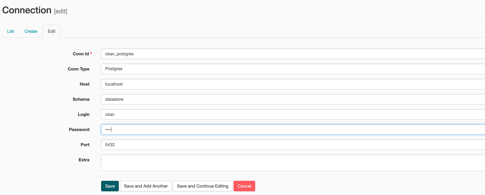

# 💨🥫 AirCan

Load data into [CKAN DataStore](https://docs.ckan.org/en/2.8/maintaining/datastore.html) using Airflow as the runner. Replacement for DataPusher and Xloader.

Clean separation of components do you can reuse what you want (e.g. don't use Airflow but use your own runner)

<!-- toc -->

- [Get Started](#get-started)
- [Examples](#examples)
  * [Example 1: CSV to JSON](#example-1-csv-to-json)
  * [Example 2: Local file to CKAN DataStore](#example-2-local-file-to-ckan-datastore)
    + [Preliminaries: Setup your CKAN instance](#preliminaries-setup-your-ckan-instance)
    + [Doing the load](#doing-the-load)
  * [Example 2a: Remote file to DataStore](#example-2a-remote-file-to-datastore)
  * [Examples 3: Auto Load file uploaded to CKAN into CKAN DataStore](#examples-3-auto-load-file-uploaded-to-ckan-into-ckan-datastore)
    + [Run it](#run-it)
- [Tutorials](#tutorials)
  * [Using Google Cloud Composer](#using-google-cloud-composer)

<!-- tocstop -->

## Get Started

* Install Python >= 3.xx (and make a virtualenv)
* Clone aircan so you have the examples
  ```
  git clone https://github.com/datopian/aircan
  ```
* Airflow: install and setup https://airflow.apache.org/docs/stable/installation.html
  ```
  export AIRFLOW_HOME=~/airflow
  pip install apache-airflow
  airflow initdb
  ```
* Start the server and visit your airflow admin UI
  ```
  airflow webserver -p 8080
  ```

Now jump into one of the examples.


## Examples

### Example 1: CSV to JSON

In this example we'll run an aircan example to convert a CSV to JSON.

Create the DAG for loading

```
cp aircan/examples/xxx.py ~/airflow/dags/
```

Run this DAG:

* Select this [screenshot]
* Configure it with a path to ../your/aircan/examples/example1.csv
* Run it ...

Check the output

* Locate the output on disk at `~/aircan-example-1.json`


### Example 2: Local file to CKAN DataStore

We'll load a local csv into CKAN DataStore instance.

#### Preliminaries: Setup your CKAN instance

We'll assume you have:

* a local CKAN setup and running at https://localhost:5000
* datastore enabled. If you are using Docker, you might need to expose your Postgres Instance port. For example, add the following in your `docker-composer.yml` file:
```yml
db:
  ports:
      - "5432:5432"
```
(Useful to know: it is possible to access the Postgres on your Docker container. Run `docker ps` and you should see a container named `docker-ckan_db`, which corresponds to CKAN database. Run `docker exec -it CONTAINER_ID bash` and then `psql -U ckan` to access the corresponding Postgres instance).

* Now you need to set up some information on Airflow. Access your local Airflow Connections panel on `http://localhost:8080/admin/connection/`. Create a new connection named `ckan_postgres` with your datastore information. For example, assuming your `CKAN_DATASTORE_WRITE_URL=postgresql://ckan:ckan@db/datastore`, use the following schema:



* We also need to set up two environment variables for Airflow. Access the Airflow Variable panel and set up `CKAN_SITE_URL` and your `CKAN_SYSADMIN_API_KEY`:


[TODO PARAMETERIZE VARS]
[TODO PARAMETERIZE PATHS]


Then create a dataset called `aircan-example` using this script:

```
cd aircan
pip install -r requirements-example.txt
python examples/setup-ckan.py --api-key
```

#### Doing the load

We assume you now have a dataset named `my-first-dataset`.

Create the DAG for loading

```
cp aircan/lib/api_ckan_load.py ~/airflow/dags/
```

Check if airflow recognize your DAG with `airflow list_dags`. You should see a DAG named `ckan_load`.

Now you can test each task individually: 

* To delete a datastore, run `airflow test ckan_load delete_datastore_table now`
* To create a datastore, run `airflow test ckan_load create_datastore_table now`. You can see the corresponding `resource_id` for the datastore on your logs. [TODO JSON is hardcoded now; parameterize on kwargs or some other operator structure]
* To load a CSV to Postgres, run `airflow test ckan_load load_csv_to_postgres_via_copy now`. [TODO JSON is hardcoded now; insert resource_id on it. File path is also Hardcode, change it]
* Finally, set your datastore to active: `airflow test ckan_load restore_indexes_and_set_datastore_active now`.


To run the entire DAG:

* Select the DAG [screenshot]
* Configure it with a path to ../your/aircan/examples/example1.csv
* Run it ... [screenshot]

Check the output

* Visit http://localhost:5000/dataset/aircan-example/ and see the resource named XXX. It will have data in its datastore now! 


### Example 2a: Remote file to DataStore

Same as example 2 but use this DAG instead:

```
cp aircan/examples/ckan-datastore-from-remote.py ~/airflow/dags/
```

Plus set a remote URL for loading.


### Examples 3: Auto Load file uploaded to CKAN into CKAN DataStore

Configure CKAN to automatically load.

* Setup CKAN - see previous
* Also install this extension in your ckan instance: ckanext-aircan-connector TODO instructions
* Configure ckan with location of your airflow instance and the dag id (`aircan-load-csv`)

#### Run it

Run this script which uploads a CSV file to your ckan instance and will trigger a load to the datastore.

```
cd aircan
pip install -r requirements-example.txt
python examples/ckan-upload-csv.py
```


## Tutorials

### Using Google Cloud Composer

* Sign up for an account
* Create a bucket for storing results and log data (automatic IIRC)
* Upload this library code ...
* Set up the DAG ...
* Configure with this file online https://raw.githubusercontent.com/datopian/aircan/examples/...
* Run it ...
